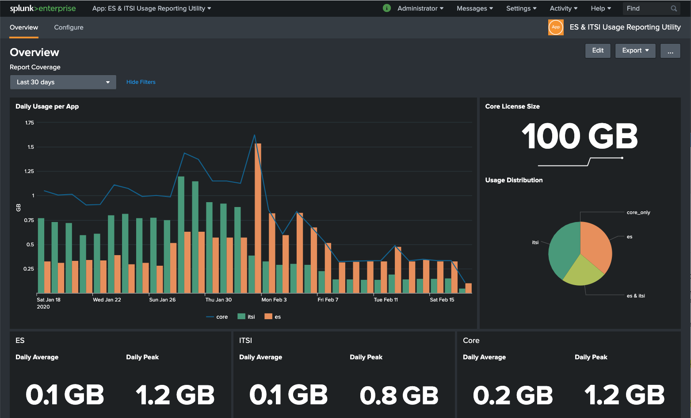

# ES / ITSI Usage Reporting

This app allows you to create a simple report on daily ES / ITSI usage in Splunk based on manual index selection. Admin can select which indexes are used for each premium app (ES or ITSI), and the app will summarize the license usage for Core, ES and ITSI.

## Requirements
The searches in the dashboard are accessing **_internal** licence_usage logs. The app will only work on a search head which has access to the **_internal** logs on the **license master**. It also would need to have access to the indexes in order to create a selection list. User has to be assigned to a role with access to the _internal indexes. The app does not need to access the ES odr ITSI indexes - it only gathers data from the license log. 

You may check if you see results with following search: 
`index=_internal source=*license_usage.log* type="Usage"`

In order to keep the results for longer period (>30days) and to increase performance of the dashboard it is highly recommended to assign a summary index. The app will check for the data in summary index and if it is not present yet the app will perform a backfill. The summary index has to exist. 

## Usage

Install the app, use "configure" page to assign indexes used for ES or ITSI. The page will display all indexes on first usage or by clicking "Auto Add Indexes" button. 

"Auto-Add Indexes" will only work, if nothing is selected yet or all indexes removed. So if you want to start over, just remove all and click on "Auto-Add Indexes". Only indexes present in the licence usage log will appear here, so if you miss any, feel free to add those using "add index" button. 

If you prefer not to use the configuration gui you may also manually  add a comma separated list (only comma, no space) to the *"reporting"* stanza in *local/app.conf*:

For better performance the app will use a summary index and the data model. If you use a summary index for licensing data already you may change the data model configuration to access your data. You may need to adapt the field names accordingly.  

Scheduled search for the summary index should be enabled. If you change the name ot the summary index, make sure the index really exists. 

`[reporting]`

`itsi_indexes = os,os_metrics,db_metrics`

`es_indexes = notable,main,dns`

`core_only_indexes = test,weather`
 

## Support

This app is not officially supported by Splunk and is provided as is.

## License

[Apache License 2.0](LICENSE.md)
